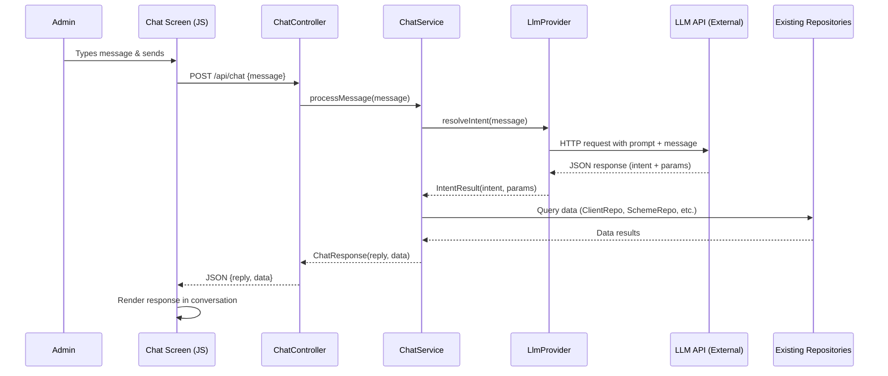
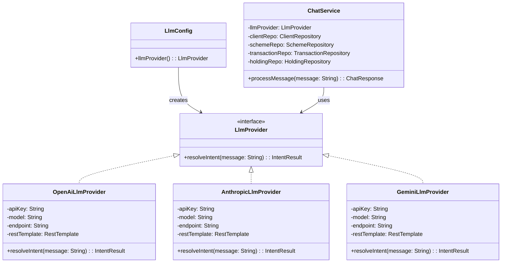

# Design Document: Admin Chat Data Query

## Overview

This feature adds a conversational chat interface to the Wealth Management Platform, allowing authenticated admins to query application data (clients, schemes, transactions, holdings, reports) using natural language messages. The system uses an LLM-based intent recognition engine on the backend to interpret admin messages, extract parameters, route to existing repositories/services, and return structured responses rendered in a chat UI.

The LLM provider is abstracted behind an interface (`LlmProvider`) so that the underlying model (OpenAI, Anthropic, Google Gemini, AWS Bedrock, local models, etc.) can be swapped by changing `application.properties` alone — no code changes required. A `ChatService` delegates intent resolution to the configured `LlmProvider`, then queries existing repositories based on the structured intent response.

The architecture follows the existing Spring Boot patterns: a new `ChatController` exposes a `POST /api/chat` endpoint, a `ChatService` orchestrates intent resolution and data retrieval, and the frontend adds a "Chat" tab with a message input and conversation history area.

## Architecture





### Key Design Decisions

1. **LLM-based intent recognition** — Instead of keyword matching, the `ChatService` delegates intent resolution to an `LlmProvider` that calls an external LLM API. The LLM receives a system prompt describing the supported intents and expected JSON output format, plus the admin's message. This handles natural language variations, typos, and complex queries far better than keyword matching.

2. **Provider-agnostic abstraction** — The `LlmProvider` interface has a single method `resolveIntent(message: String): IntentResult`. Concrete implementations (e.g., `OpenAiLlmProvider`, `AnthropicLlmProvider`, `GeminiLlmProvider`) handle provider-specific HTTP calls, auth headers, and response parsing. A Spring `@Configuration` class reads `app.llm.provider` from `application.properties` and instantiates the correct implementation.

3. **Configuration-driven model switching** — All LLM settings live in `application.properties`: provider name, model name, API key, endpoint URL, temperature, and max tokens. Switching from OpenAI GPT-4o to Anthropic Claude or Google Gemini is a config-only change. No recompilation needed.

4. **Structured JSON output from LLM** — The system prompt instructs the LLM to return a JSON object with `intent` (enum string) and `params` (map of extracted parameters like `clientName`, `schemeName`, `transactionType`, `sortBy`, `sortOrder`). The `LlmProvider` parses this JSON into an `IntentResult` data class.

5. **Reuse existing repositories** — `ChatService` delegates to `ClientRepository`, `SchemeRepository`, `TransactionRepository`, `HoldingRepository`, and `ReportService`. No new database tables or queries are needed.

6. **Session-scoped conversation history on the frontend only** — The backend is stateless per request. Conversation history is maintained in the browser's JavaScript memory for the current session.

7. **Structured response format** — The API returns both a human-readable `reply` string and an optional `data` array for tabular rendering.

## Components and Interfaces

### Backend Components

#### LlmProvider Interface (`com.wealthmgmt.llm.LlmProvider`)

The abstraction layer for LLM-based intent resolution.

```kotlin
interface LlmProvider {
    fun resolveIntent(message: String): IntentResult
}
```

Returns a structured `IntentResult` parsed from the LLM's JSON response.

#### OpenAiLlmProvider (`com.wealthmgmt.llm.OpenAiLlmProvider`)

Implementation for OpenAI-compatible APIs (OpenAI, Azure OpenAI, local models with OpenAI-compatible endpoints).

```kotlin
class OpenAiLlmProvider(
    private val apiKey: String,
    private val model: String,
    private val endpoint: String,
    private val restTemplate: RestTemplate
) : LlmProvider {
    override fun resolveIntent(message: String): IntentResult
}
```

- Sends a POST to `{endpoint}/chat/completions` with the system prompt and user message.
- Parses the `choices[0].message.content` JSON into `IntentResult`.
- Uses `Authorization: Bearer {apiKey}` header.

#### AnthropicLlmProvider (`com.wealthmgmt.llm.AnthropicLlmProvider`)

Implementation for Anthropic's Messages API.

```kotlin
class AnthropicLlmProvider(
    private val apiKey: String,
    private val model: String,
    private val endpoint: String,
    private val restTemplate: RestTemplate
) : LlmProvider {
    override fun resolveIntent(message: String): IntentResult
}
```

- Sends a POST to `{endpoint}/messages` with `x-api-key` header.
- Parses the `content[0].text` JSON into `IntentResult`.

#### GeminiLlmProvider (`com.wealthmgmt.llm.GeminiLlmProvider`)

Implementation for Google's Gemini API (Generative Language API).

```kotlin
class GeminiLlmProvider(
    private val apiKey: String,
    private val model: String,
    private val endpoint: String,
    private val restTemplate: RestTemplate
) : LlmProvider {
    override fun resolveIntent(message: String): IntentResult
}
```

- Sends a POST to `{endpoint}/v1beta/models/{model}:generateContent?key={apiKey}`.
- Constructs a request body with `contents` array containing the system instruction and user message parts.
- Parses the `candidates[0].content.parts[0].text` JSON into `IntentResult`.
- Uses API key as a query parameter (Gemini's auth model) rather than a header.

#### LlmConfig (`com.wealthmgmt.config.LlmConfig`)

Spring `@Configuration` class that reads properties and creates the appropriate `LlmProvider` bean.

```kotlin
@Configuration
class LlmConfig {

    @Bean
    fun llmProvider(
        @Value("\${app.llm.provider}") provider: String,
        @Value("\${app.llm.api-key}") apiKey: String,
        @Value("\${app.llm.model}") model: String,
        @Value("\${app.llm.endpoint}") endpoint: String,
        restTemplate: RestTemplate
    ): LlmProvider = when (provider.lowercase()) {
        "openai" -> OpenAiLlmProvider(apiKey, model, endpoint, restTemplate)
        "anthropic" -> AnthropicLlmProvider(apiKey, model, endpoint, restTemplate)
        "gemini" -> GeminiLlmProvider(apiKey, model, endpoint, restTemplate)
        else -> throw IllegalArgumentException("Unsupported LLM provider: $provider")
    }

    @Bean
    fun restTemplate(): RestTemplate = RestTemplate()
}
```

#### System Prompt (embedded in LlmProvider implementations)

The system prompt sent to the LLM on each request:

```
You are an intent classifier for a wealth management admin chat. Given the admin's message, determine the intent and extract parameters.

Respond with ONLY a JSON object in this exact format:
{
  "intent": "CLIENTS" | "SCHEMES" | "TRANSACTIONS" | "HOLDINGS" | "REPORT" | "UNKNOWN",
  "params": {
    "clientName": "<extracted client name or null>",
    "schemeName": "<extracted scheme name or null>",
    "schemeType": "<extracted scheme type or null>",
    "transactionType": "<'buy' or 'sell' or null>",
    "sortBy": "<'value' or null>",
    "sortOrder": "<'asc' or 'desc' or null>"
  }
}

Supported intents:
- CLIENTS: queries about clients, client lists, client details
- SCHEMES: queries about schemes, funds, investment options
- TRANSACTIONS: queries about transactions, trades, buys, sells
- HOLDINGS: queries about holdings, portfolio, positions
- REPORT: requests for reports, capital gains reports, download links
- UNKNOWN: anything that doesn't match the above categories
```

#### ChatController (`com.wealthmgmt.controller.ChatController`)

REST controller exposing the chat endpoint. Secured by existing Spring Security session auth.

```kotlin
@RestController
@RequestMapping("/api/chat")
class ChatController(private val chatService: ChatService) {

    @PostMapping
    fun chat(@RequestBody request: ChatRequest): ResponseEntity<ChatResponse>
}
```

- Validates that `request.message` is non-blank; returns 400 if empty/missing.
- Delegates to `ChatService.processMessage(message)`.
- Returns `ChatResponse` as JSON.

#### ChatService (`com.wealthmgmt.service.ChatService`)

Core service that orchestrates LLM-based intent resolution and data retrieval.

```kotlin
@Service
class ChatService(
    private val llmProvider: LlmProvider,
    private val clientRepo: ClientRepository,
    private val schemeRepo: SchemeRepository,
    private val transactionRepo: TransactionRepository,
    private val holdingRepo: HoldingRepository
) {
    fun processMessage(message: String): ChatResponse
}
```

**Processing flow:**
1. Calls `llmProvider.resolveIntent(message)` to get an `IntentResult`.
2. Based on `intentResult.intent`, delegates to the appropriate repository with extracted params.
3. For `CLIENTS`: calls `clientRepo.findAll()`, filters by `params.clientName` if present.
4. For `SCHEMES`: calls `schemeRepo.findAll()`, filters by `params.schemeName` or `params.schemeType`.
5. For `TRANSACTIONS`: calls `transactionRepo.findAll()`, filters by `params.transactionType` or resolves `params.clientName` to a client ID.
6. For `HOLDINGS`: resolves `params.clientName`/`params.schemeName` to IDs, passes `params.sortBy`/`params.sortOrder` to `holdingRepo.getHoldings()`.
7. For `REPORT`: resolves `params.clientName` to client ID, returns report download URLs.
8. For `UNKNOWN`: returns a help message listing supported query types.

#### New Model Classes (`com.wealthmgmt.model`)

```kotlin
data class ChatRequest(val message: String)

data class ChatResponse(
    val reply: String,
    val data: List<Map<String, Any?>>? = null
)

enum class Intent {
    CLIENTS, SCHEMES, TRANSACTIONS, HOLDINGS, REPORT, UNKNOWN
}

data class IntentResult(
    val intent: Intent,
    val params: Map<String, String?> = emptyMap()
)
```

### Configuration Properties

New properties in `application.properties`:

```properties
# LLM Configuration
app.llm.provider=openai
app.llm.api-key=${LLM_API_KEY:}
app.llm.model=gpt-4o-mini
app.llm.endpoint=https://api.openai.com/v1
app.llm.temperature=0.0
app.llm.max-tokens=256
```

To switch to Anthropic, change only:

```properties
app.llm.provider=anthropic
app.llm.api-key=${ANTHROPIC_API_KEY:}
app.llm.model=claude-sonnet-4-20250514
app.llm.endpoint=https://api.anthropic.com/v1
```

To switch to Google Gemini, change only:

```properties
app.llm.provider=gemini
app.llm.api-key=${GEMINI_API_KEY:}
app.llm.model=gemini-2.0-flash
app.llm.endpoint=https://generativelanguage.googleapis.com
```

The API key is read from an environment variable by default to avoid committing secrets.

### Frontend Components

#### Chat Tab (HTML)

A new `<section id="tab-chat">` added to `index.html` containing:
- A conversation history container (`#chat-messages`)
- A message input form with text input and send button
- Welcome message displayed on load

#### Chat Tab (JavaScript)

New functions added to `app.js`:
- `sendChatMessage()` — sends POST to `/api/chat`, appends admin message and response to history
- `appendMessage(role, content, data)` — renders a message bubble; if `data` is present, renders an HTML table
- `renderChatTable(data)` — converts `data` array of maps into an HTML `<table>`
- `renderReportLinks(data)` — renders report URLs as clickable `<a>` tags

#### Chat Tab (CSS)

New styles in `style.css` for:
- `.chat-container` — flex column layout for the conversation area
- `.chat-message.admin` / `.chat-message.system` — different alignment and background colors
- `.chat-input-form` — fixed-bottom input bar within the chat tab
- `.chat-loading` — loading indicator styling
- `.chat-timestamp` — small timestamp text

### Navigation Update

Add a `<a href="#" data-tab="chat">Chat</a>` link to the `<nav>` element in `index.html`.

## Data Models

### Request/Response Schemas

**POST `/api/chat`**

Request body:
```json
{
  "message": "show me all clients"
}
```

Success response (200):
```json
{
  "reply": "Here are all clients:",
  "data": [
    {"id": 1, "name": "Alice", "email": "alice@example.com", "phone": "555-0001"},
    {"id": 2, "name": "Bob", "email": "bob@example.com", "phone": "555-0002"}
  ]
}
```

Help/unknown response (200):
```json
{
  "reply": "I can help you query: clients, schemes, transactions, holdings, and reports. Try asking something like 'show me all clients' or 'what are the holdings for Alice?'",
  "data": null
}
```

Report response (200):
```json
{
  "reply": "Here are the report download links for Alice:",
  "data": [
    {"reportType": "Holdings", "url": "/api/reports/holdings/1"},
    {"reportType": "Transactions", "url": "/api/reports/transactions/1"},
    {"reportType": "Capital Gains", "url": "/api/reports/capital-gains/1"}
  ]
}
```

Error response (400):
```json
{
  "reply": "Message cannot be empty.",
  "data": null
}
```

### LLM Intent Resolution Schema

The JSON structure returned by the LLM and parsed into `IntentResult`:

```json
{
  "intent": "HOLDINGS",
  "params": {
    "clientName": "Alice",
    "schemeName": null,
    "schemeType": null,
    "transactionType": null,
    "sortBy": "value",
    "sortOrder": "desc"
  }
}
```

### Existing Data Models (unchanged)

The feature reuses `Client`, `Scheme`, `Transaction`, `Holding` models as-is. No new database tables are required. The `ChatResponse.data` field serializes these as `List<Map<String, Any?>>` for uniform frontend rendering.


## Correctness Properties

*A property is a characteristic or behavior that should hold true across all valid executions of a system — essentially, a formal statement about what the system should do. Properties serve as the bridge between human-readable specifications and machine-verifiable correctness guarantees.*

### Property 1: Intent routing correctness

*For any* `IntentResult` with a valid `Intent` enum value, `ChatService.processMessage()` should query the correct repository: `CLIENTS` → `ClientRepository`, `SCHEMES` → `SchemeRepository`, `TRANSACTIONS` → `TransactionRepository`, `HOLDINGS` → `HoldingRepository`, `REPORT` → report URL generation, `UNKNOWN` → help message with no repository call. The LLM provider is mocked in tests to return controlled `IntentResult` values.

**Validates: Requirements 3.1, 3.2, 3.3, 3.4, 3.5, 3.6**

### Property 2: Empty/blank message rejection

*For any* string composed entirely of whitespace (including the empty string), `ChatController.chat()` should return HTTP 400 and the response `reply` should contain a descriptive error message.

**Validates: Requirements 2.3, 9.4**

### Property 3: Response structure invariant

*For any* non-blank message string, the `ChatResponse` returned by `ChatService.processMessage()` should always contain a non-empty `reply` string. The `data` field may be null but `reply` must never be null or blank.

**Validates: Requirements 9.2**

### Property 4: Filtered query results contain only matching records

*For any* entity type (client, scheme, transaction, holding) and *for any* filter parameter extracted by the LLM (clientName, schemeName, schemeType, transactionType), every record in the returned `data` list should match the filter criteria. Specifically: for client name filters, every returned client's name should contain the filter string (case-insensitive); for scheme name/type filters, every returned scheme should match; for transaction type filters ("buy"/"sell"), every returned transaction should have the matching type.

**Validates: Requirements 4.2, 5.2, 6.2, 7.2**

### Property 5: Holdings sort order

*For any* `IntentResult` with intent `HOLDINGS` that includes sortBy and sortOrder params, the returned holdings `data` list should be ordered by `holdingValue` in the specified direction (ascending or descending).

**Validates: Requirements 7.3**

### Property 6: Report URL correctness

*For any* `IntentResult` with intent `REPORT` and a valid `clientName` param that matches an existing client, the returned `data` should contain exactly three entries (holdings, transactions, capital gains) and each URL should contain the correct client ID. *For any* `IntentResult` with intent `REPORT` and null `clientName`, the response `reply` should ask the admin to specify a client name and `data` should be null.

**Validates: Requirements 8.1, 8.2**

### Property 7: Data query results include required fields

*For any* data query response with non-null `data`, every record in the `data` list should contain all required fields for its entity type: clients must have `id`, `name`, `email`, `phone`; schemes must have `id`, `name`, `type`, `nav`; transactions must have `id`, `clientId`, `schemeId`, `type`, `units`, `amount`, `date`; holdings must have `clientName`, `schemeName`, `units`, `holdingValue`.

**Validates: Requirements 4.1, 5.1, 6.1, 7.1**

### Property 8: Tabular rendering includes all data values

*For any* `data` array of maps, the `renderChatTable(data)` function should produce an HTML string containing a `<table>` element, and for every map in the array, every value should appear in the rendered output.

**Validates: Requirements 4.3, 5.3, 6.3, 7.4**

### Property 9: Chat service error containment

*For any* exception thrown by an underlying repository or by the LLM provider during processing, `ChatService.processMessage()` should catch the exception and return a `ChatResponse` with a non-empty `reply` describing the failure, rather than propagating the exception.

**Validates: Requirements 11.3**

### Property 10: Timestamps on rendered messages

*For any* chat message rendered in the conversation history, the rendered HTML should contain a timestamp string in a recognizable time format.

**Validates: Requirements 10.4**

### Property 11: LLM response parsing round trip

*For any* valid `IntentResult` object, serializing it to the JSON format expected from the LLM and then parsing it back through the provider's response parser should produce an equivalent `IntentResult`.

**Validates: Requirements 3.1, 3.2, 3.3, 3.4, 3.5**

## Error Handling

### Backend Error Handling

- **Empty message**: `ChatController` validates `request.message` is non-blank before delegating to `ChatService`. Returns HTTP 400 with `ChatResponse(reply = "Message cannot be empty.")`.
- **Unknown intent**: When the LLM returns `UNKNOWN` intent, `ChatService` returns a 200 response with a help message listing supported query types. This is not an error — it's a graceful fallback.
- **LLM API failure**: If the `LlmProvider` throws an exception (network timeout, auth failure, rate limit, malformed response), `ChatService.processMessage()` catches it and returns `ChatResponse(reply = "Sorry, I'm having trouble understanding your request right now. Please try again.")`. The exception is logged for debugging.
- **LLM response parsing failure**: If the LLM returns non-JSON or JSON that doesn't match the expected schema, the `LlmProvider` implementation returns `IntentResult(intent = UNKNOWN, params = emptyMap())` as a safe fallback, and logs a warning.
- **Repository exceptions**: `ChatService.processMessage()` wraps all repository calls in a try-catch. On failure, returns `ChatResponse(reply = "Sorry, I encountered an error while querying data: {exception message}")`.
- **Client not found for reports**: When a report intent includes a client name that doesn't match any client, returns a response saying no client was found with that name.
- **Authentication**: Handled by existing Spring Security config. Unauthenticated requests to `/api/chat` receive HTTP 401 automatically.
- **Missing LLM configuration**: If `app.llm.provider` is not set or is an unsupported value (i.e., not `openai`, `anthropic`, or `gemini`), the application fails to start with a clear error message from `LlmConfig`.

### Frontend Error Handling

- **HTTP error responses**: The `sendChatMessage()` function checks `response.ok`. On failure, appends a system message: "Something went wrong. Please try again."
- **Network errors**: The fetch call's catch block appends a system message: "Connection error. Please check your network and try again." and re-enables the send button.
- **Empty input prevention**: The send button click handler checks for blank input and returns early without making an API call.

## Testing Strategy

### Unit Tests

Unit tests verify specific examples, edge cases, and integration points:

- **ChatController tests** (using MockMvc):
  - POST `/api/chat` with valid message returns 200 with reply
  - POST `/api/chat` with empty body returns 400
  - POST `/api/chat` without authentication returns 401
  - POST `/api/chat` with client query returns client data (LLM provider mocked)
  - POST `/api/chat` with unknown message returns help text

- **ChatService tests** (LlmProvider mocked):
  - `processMessage()` with mocked CLIENTS intent returns client data
  - `processMessage()` with mocked SCHEMES intent returns scheme data
  - `processMessage()` with mocked REPORT intent and valid client returns report URLs
  - `processMessage()` with mocked REPORT intent and no client name returns prompt
  - `processMessage()` with mocked HOLDINGS intent and sort params returns sorted results

- **LlmProvider implementation tests**:
  - `OpenAiLlmProvider.resolveIntent()` sends correct HTTP request format (RestTemplate mocked)
  - `AnthropicLlmProvider.resolveIntent()` sends correct headers and body format
  - `GeminiLlmProvider.resolveIntent()` sends correct URL with API key query param and body format
  - All three providers correctly parse valid LLM JSON responses into `IntentResult`
  - All three providers handle malformed LLM responses gracefully (return UNKNOWN)

- **LlmConfig tests**:
  - Config with `provider=openai` creates `OpenAiLlmProvider`
  - Config with `provider=anthropic` creates `AnthropicLlmProvider`
  - Config with `provider=gemini` creates `GeminiLlmProvider`
  - Config with unsupported provider throws `IllegalArgumentException`

- **Frontend tests** (example-based):
  - Chat tab becomes visible when clicked
  - Welcome message is displayed on load
  - Report URLs render as clickable links

### Property-Based Tests

Property-based tests use **Kotest** with its property testing module (`kotest-property`), which is the standard PBT library for Kotlin. Each property test runs a minimum of 100 iterations.

Each test is tagged with a comment referencing the design property:

```kotlin
// Feature: admin-chat-data-query, Property 1: Intent routing correctness
```

**Property tests to implement:**

1. **Property 1**: Generate random `Intent` enum values. Mock the `LlmProvider` to return an `IntentResult` with that intent. Call `processMessage()` and verify the correct repository was invoked (using mock verification).
2. **Property 2**: Generate random whitespace-only strings (spaces, tabs, newlines, empty). Assert the controller returns 400.
3. **Property 3**: Generate random non-blank strings. Mock the `LlmProvider` to return any valid `IntentResult`. Assert `processMessage()` returns a `ChatResponse` with non-blank `reply`.
4. **Property 4**: Generate random filter values and entity types. Mock the `LlmProvider` to return `IntentResult` with those filters. Seed test data, call `processMessage()`, and assert all returned records match the filter.
5. **Property 5**: Seed holdings data, mock `LlmProvider` to return HOLDINGS intent with random sort directions. Assert returned data is ordered correctly.
6. **Property 6**: Seed client data, mock `LlmProvider` to return REPORT intent with valid/null client names. Assert response contains 3 URLs with correct client ID, or asks for client name.
7. **Property 7**: Generate `IntentResult` for each entity type. Assert all returned records contain the required fields.
8. **Property 8**: Generate random arrays of maps. Assert `renderChatTable()` output contains `<table>` and all values.
9. **Property 9**: Mock `LlmProvider` and repositories to throw random exceptions. Assert `processMessage()` returns error response without throwing.
10. **Property 10**: Generate random messages. Assert rendered output contains a timestamp pattern.
11. **Property 11**: Generate random valid `IntentResult` objects. Serialize to JSON, parse back through the provider's parser. Assert equivalence.

### Test Configuration

- **Backend**: Add `io.kotest:kotest-property:5.9.1` to `pom.xml` test dependencies
- **Mocking**: Use Mockito or MockK to mock `LlmProvider` in `ChatService` tests — this isolates intent routing logic from the actual LLM API
- **Frontend**: Property 8 and 10 can be tested with a lightweight JS test runner or verified manually
- **Minimum iterations**: 100 per property test
- **Test location**: `backend/src/test/kotlin/com/wealthmgmt/ChatServicePropertyTests.kt` and `backend/src/test/kotlin/com/wealthmgmt/ChatControllerTests.kt`
- **LLM provider tests**: `backend/src/test/kotlin/com/wealthmgmt/LlmProviderTests.kt` — uses mocked `RestTemplate` to verify HTTP request/response handling for OpenAI, Anthropic, and Gemini providers without calling real LLM APIs
